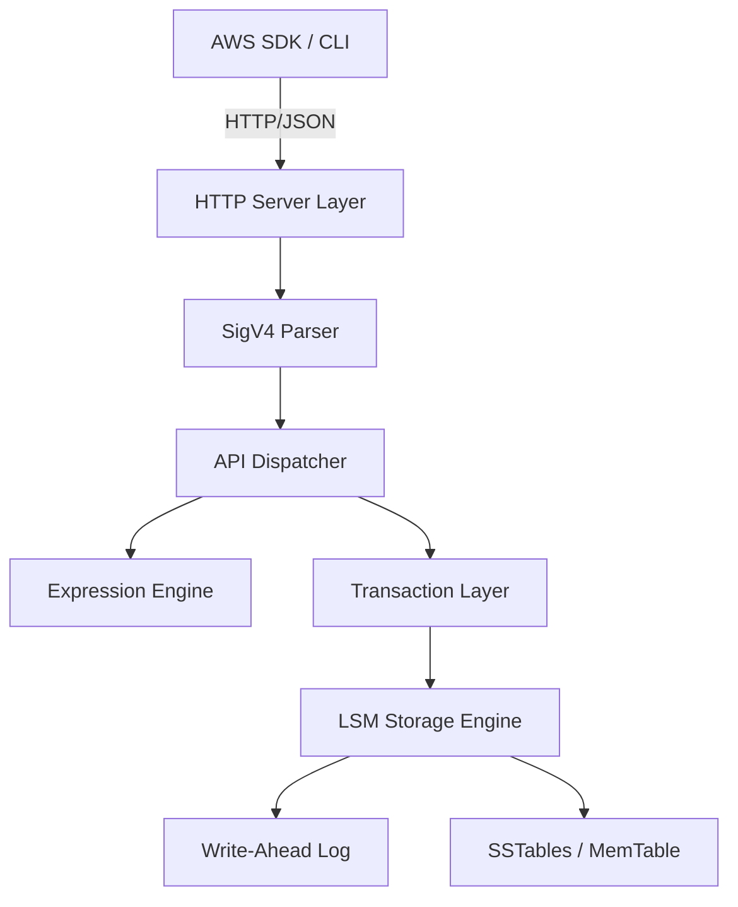

# cynamoDB v2.1.2

cynamoDB is a high-performance, local DynamoDB-compatible database engine written in C++23. It provides 1:1 API compatibility with Amazon DynamoDB, enabling local development, testing, and edge computing without relying on the AWS cloud.

## Project Overview
cynamoDB acts as a drop-in replacement for AWS DynamoDB. It implements the same HTTP + JSON protocol, supporting standard AWS SDKs, CLI, and infrastructure-as-code tooling. It is designed for researchers, developers, and CI/CD environments that require a fast, reliable, and deterministic DynamoDB environment.

## Architecture Summary
The engine is built on a modular architecture:
- **HTTP Layer**: Boost.Beast-based server handling REST requests.
- **Auth Layer**: SigV4 signature verification.
- **API Dispatcher**: Routes requests to specific handlers.
- **Expression Engine**: Parsers and evaluators for DynamoDB expressions.
- **Storage Engine**: Pluggable LSM-tree (Log-Structured Merge-tree) for high performance.
- **Transaction Layer**: ACID compliance using MVCC and write intents.



## Tech Stack
- **Language**: C++23
- **Build System**: CMake
- **Serialization**: simdjson
- **Networking**: Boost.Beast
- **Storage**: Custom LSM Tree
- **Testing**: Catch2, Fuzzing

## Quick Start
1. **Build**:
   ```bash
   mkdir build && cd build
   cmake .. -DCMAKE_BUILD_TYPE=Release
   make -j$(nproc)
   ```
2. **Run**:
   ```bash
   ./cynamodb --port 8000 --data-dir ./data
   ```
3. **Use with CLI**:
   ```bash
   aws dynamodb list-tables --endpoint-url http://localhost:8000
   ```

See [Installation Guide](docs/install.md) and [First Run](docs/first-run.md) for more details.

## Documentation Index
- [Installation Guide](docs/install.md) - Build and system requirements.
- [Setup & Config](docs/setup.md) - Environment variables and CLI options.
- [First Run](docs/first-run.md) - Getting started quickly.
- [Functionality](docs/functionality.md) - Supported features and workflows.
- [Data Schema](docs/schema.md) - Internal storage and data model.
- [API Reference](docs/api.md) - Endpoints and compliance.
- [SDK Integrations](docs/integrations.md) - Using with AWS SDKs.
- [Implementation Details](docs/implementation.md) - Architecture and internals.
- [Testing & Coverage](docs/testing.md) - How to run tests.
- [Security Model](docs/security.md) - Auth, SigV4, and transport.
- [Troubleshooting](docs/troubleshooting.md) - Common issues and fixes.
- [Contributing](docs/contributing.md) - Developer workflow.

## License
MIT License - See [LICENSE](LICENSE) (if present) or contact maintainers.
