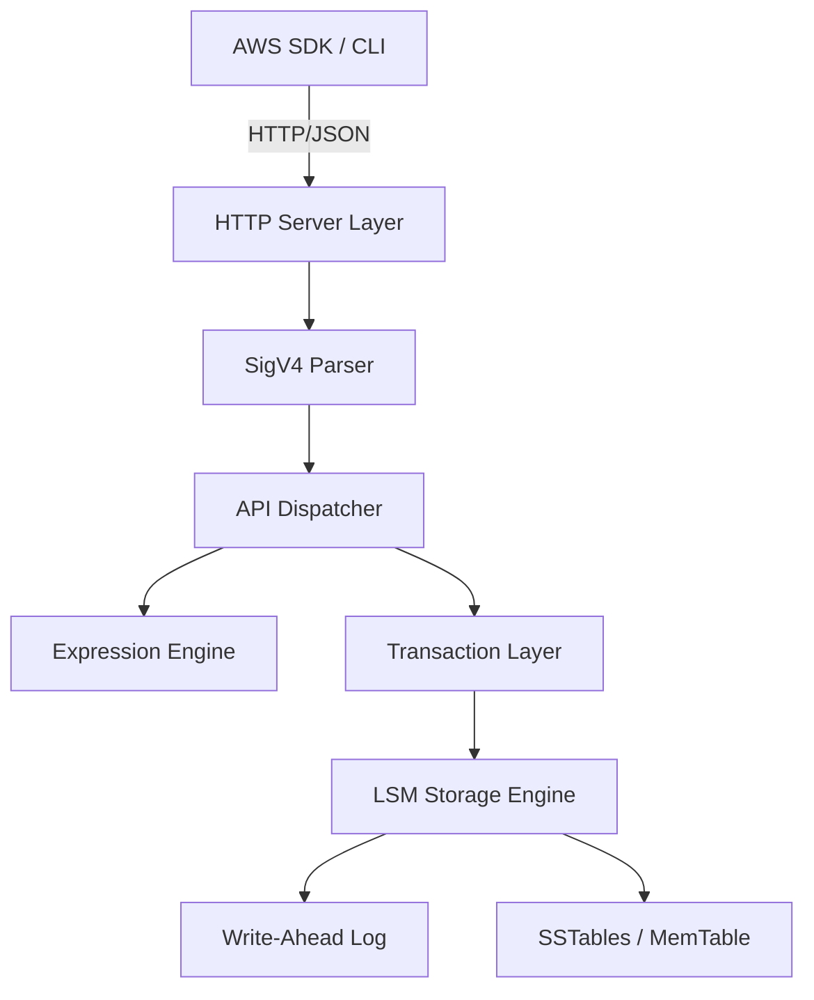

# cynamoDB v2.5.4

cynamoDB is a high-performance, local DynamoDB-compatible database engine written in C++23. It provides 1:1 API compatibility with Amazon DynamoDB, enabling local development, testing, and edge computing without relying on the AWS cloud.

## Project Overview
cynamoDB acts as a drop-in replacement for AWS DynamoDB. It implements the same HTTP + JSON protocol, supporting standard AWS SDKs, CLI, and infrastructure-as-code tooling. It is designed for researchers, developers, and CI/CD environments that require a fast, reliable, and deterministic DynamoDB environment.

## Architecture Summary
The engine is built on a modular architecture:
- **HTTP Layer**: Boost.Beast-based server handling REST requests.
- **Auth Layer**: SigV4 signature verification.
- **API Dispatcher**: Routes requests to specific handlers.
- **Expression Engine**: Parsers and evaluators for DynamoDB expressions.
- **Storage Engine**: Pluggable LSM-tree (Log-Structured Merge-tree) for high performance.
- **Transaction Layer**: ACID compliance using MVCC and write intents.



## Tech Stack
- **Language**: C++23
- **Build System**: CMake
- **Serialization**: simdjson
- **Networking**: Boost.Beast
- **Storage**: Custom LSM Tree
- **Testing**: Catch2, Fuzzing

## Quick Start
1. **Build**:
   ```bash
   cmake -S . -B build -G Ninja -DCMAKE_BUILD_TYPE=Release
   cmake --build build -j
   ```
2. **Run** (configured via environment variables):
   ```bash
   CYNAMODB_DATA_DIR=./data CYNAMODB_PORT=8000 ./build/cynamodb
   ```
   Recognized variables: `CYNAMODB_BIND_ADDR` (default `0.0.0.0`), `CYNAMODB_PORT`
   (default `8000`), `CYNAMODB_THREADS`, `CYNAMODB_DATA_DIR` (default `./data`),
   `CYNAMODB_WAL_FSYNC` (`0` to disable per-write fsync for throughput),
   `CYNAMODB_REQUIRE_AUTH` (`1` to enforce full SigV4 verification),
   `CYNAMODB_ACCESS_KEY_ID` / `CYNAMODB_SECRET_ACCESS_KEY` (SigV4 credential).
3. **Use with the AWS CLI / SDKs**:
   ```bash
   aws dynamodb create-table --endpoint-url http://localhost:8000 \
     --table-name Users --billing-mode PAY_PER_REQUEST \
     --attribute-definitions AttributeName=id,AttributeType=S \
     --key-schema AttributeName=id,KeyType=HASH
   aws dynamodb put-item --endpoint-url http://localhost:8000 \
     --table-name Users --item '{"id":{"S":"u1"},"name":{"S":"Alice"}}'
   aws dynamodb get-item --endpoint-url http://localhost:8000 \
     --table-name Users --key '{"id":{"S":"u1"}}'
   ```

## Supported operations

The HTTP/JSON data plane is implemented end-to-end:

- **Tables**: `CreateTable`, `DescribeTable`, `ListTables`, `DeleteTable`,
  `UpdateTable` (minimal)
- **Items**: `PutItem`, `GetItem`, `UpdateItem`, `DeleteItem` — with
  `ConditionExpression` (returning `ConditionalCheckFailedException`),
  `UpdateExpression` (`SET`/`REMOVE`/`ADD`/`DELETE`, `+`/`-`, `if_not_exists`,
  `list_append`), and `ReturnValues`
- **Bulk reads**: `Scan` and `Query` with `FilterExpression`,
  `ProjectionExpression`, `Limit`/`ExclusiveStartKey` pagination. `Query` supports
  modern `KeyConditionExpression` (and legacy `KeyConditions`) with sort-key
  operators (`=`, `<`, `<=`, `>`, `>=`, `BETWEEN`, `begins_with`) and
  `ScanIndexForward`.
- **Batch & transactions**: `BatchGetItem`, `BatchWriteItem`,
  `TransactWriteItems` (all-or-nothing), `TransactGetItems`
- **Secondary indexes**: GSI/LSI parsed, maintained on every write, and queryable via
  `Query`/`Scan` with `IndexName` (projection types, sparse indexes)
- **Streams**: `ListStreams`/`DescribeStream`/`GetShardIterator`/`GetRecords` with
  INSERT/MODIFY/REMOVE records and NEW/OLD images
- **TTL**: `UpdateTimeToLive`/`DescribeTimeToLive`; expired items filtered from reads
- **PartiQL**: `ExecuteStatement`/`BatchExecuteStatement` (SELECT/INSERT/UPDATE/DELETE)
- **Backups**: `CreateBackup`/`RestoreTableFromBackup`/… (durable snapshots), PITR,
  continuous backups, and single-region global tables
- **Document paths** (`a.b.c`, `a[0]`) in all expressions; **provisioned-throughput
  throttling**; **full SigV4 verification** via `CYNAMODB_REQUIRE_AUTH=1`

**All attribute types round-trip and persist**, including across a memtable→SSTable
flush: `S`, `N`, `B` (base64), `BOOL`, `NULL`, `M`, `L`, `SS`, `NS`, `BS`.

A handful of operations remain `501 NotImplementedException` (PartiQL transactions,
Contributor Insights, imports/exports, Kinesis streaming, resource policies, tagging,
auto-scaling).

See [docs/api.md](docs/api.md#api-compliance-status) for the authoritative,
contract-tested matrix of what is implemented vs. planned, and
[tests/TEST_COVERAGE.md](tests/TEST_COVERAGE.md) for the coverage map.

## Durability & persistence

- **Write-ahead log**: every acknowledged write is `fdatasync`'d to disk, so data
  survives a process crash (`kill -9`) and a power/OS crash. Set `CYNAMODB_WAL_FSYNC=0`
  to trade durability for throughput.
- **LSM storage**: the memtable flushes to immutable SSTables, which are merged by a
  background compaction that keeps the on-disk file count bounded and purges tombstones.
- **Recovery**: on startup the engine reloads SSTables from the manifest and replays the
  WAL; the table catalog is persisted atomically. Tables and items survive restarts.

## Testing

```bash
cmake -S . -B build -G Ninja -DCMAKE_BUILD_TYPE=Debug && cmake --build build -j
ctest --test-dir build --output-on-failure
```

This runs the Catch2 unit suite plus live integration tests that drive the real server
binary over HTTP — full CRUD across restarts, crash recovery (`SIGKILL`), and concurrent
multi-client load. See [tests/TEST_COVERAGE.md](tests/TEST_COVERAGE.md) for details.

See [Installation Guide](docs/install.md) and [First Run](docs/first-run.md) for more details.

## Documentation Index
- [Installation Guide](docs/install.md) - Build and system requirements.
- [Setup & Config](docs/setup.md) - Environment variables and CLI options.
- [First Run](docs/first-run.md) - Getting started quickly.
- [Functionality](docs/functionality.md) - Supported features and workflows.
- [Data Schema](docs/schema.md) - Internal storage and data model.
- [API Reference](docs/api.md) - Endpoints and compliance.
- [SDK Integrations](docs/integrations.md) - Using with AWS SDKs.
- [Implementation Details](docs/implementation.md) - Architecture and internals.
- [Testing & Coverage](docs/testing.md) - How to run tests.
- [Security Model](docs/security.md) - Auth, SigV4, and transport.
- [Troubleshooting](docs/troubleshooting.md) - Common issues and fixes.
- [Contributing](docs/contributing.md) - Developer workflow.

## License
MIT License - See [LICENSE](LICENSE) (if present) or contact maintainers.
